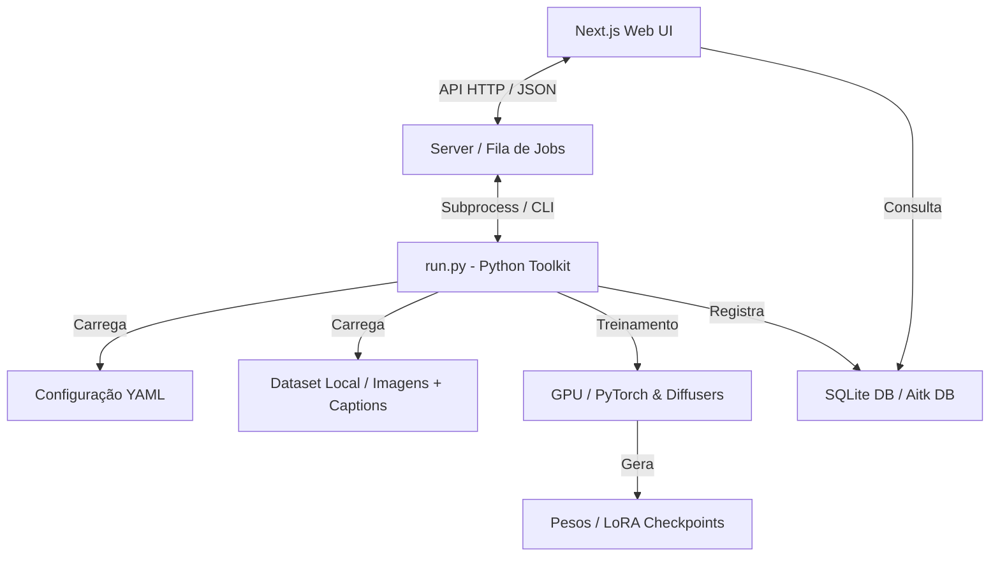

# Mapa do Projeto - Ostris AI Toolkit (HEX MOD)

## Índice
1. [Introdução](#introdução)
2. [Arquitetura Geral](#arquitetura-geral)
3. [Tabelas de Componentes](#tabelas-de-componentes)
   - [Componentes Backend (Python Toolkit)](#componentes-backend-python-toolkit)
   - [Componentes Frontend (Next.js UI)](#componentes-frontend-nextjs-ui)
4. [Diagramas de Arquitetura](#diagramas-de-arquitetura)
5. [Fluxos de IA e Modelos (LLMs & Captioning)](#fluxos-de-ia-e-modelos-llms--captioning)

---

## Introdução
O **Ostris AI Toolkit (HEX MOD)** é uma suíte de treinamento "tudo em um" para modelos de difusão de imagens, vídeos e áudios (como FLUX.1, SDXL, Wan 2.1, etc.). O toolkit pode ser executado via interface de linha de comando (CLI) ou interface gráfica (GUI).
A versão **HEX MOD** é uma bifurcação (fork) otimizada para usuários avançados que introduz suporte offline completo, integração nativa do otimizador **Rose**, melhorias no cálculo de passos de treinamento, agendamento de taxa de aprendizado (Learning Rate cosine com warmup) e recursos aprimorados de visualização de métricas (gráficos de perda com duplo eixo).

As tecnologias principais são:
- **Backend/Toolkit**: Python, PyTorch, Diffusers, Hugging Face Transformers.
- **Frontend (UI)**: Next.js (App Router), React, Tailwind CSS, TypeScript, Lucide React, Headless UI.

---

## Arquitetura Geral
O projeto é estruturado em duas partes principais:
1. **Core / Python Toolkit**: Gerencia o carregamento de dados, modelos de difusão (U-Net, MMDiT), otimizadores (como AdamW, Rose) e o loop de treinamento propriamente dito.
2. **Next.js UI**: Interface web executada em Node.js (porta default `8675`) que gerencia a fila de jobs, configuração de novos treinamentos e exibe estatísticas em tempo real, comunicando-se com o backend do toolkit.

---

## Tabelas de Componentes

### Componentes Backend (Python Toolkit)

| Arquivo/Diretório | Função/Responsabilidade | Provimentos | Estado | Déficits/Melhorias |
| :--- | :--- | :--- | :--- | :--- |
| `run.py` | Ponto de entrada CLI para iniciar jobs de treinamento a partir de arquivos de configuração YAML/JSON. | Execução de pipelines de treinamento e carregamento de configurações. | **Completo** | Nenhuma pendência imediata. |
| `flux_train_ui.py` | Interface Gradio integrada para facilitar o upload, legenda e treinamento rápido de LoRA para modelos Flux. | Servidor Gradio local e fluxo simplificado de ponta a ponta. | **Completo** | Interface simples, mas funcional para tarefas isoladas. |
| `toolkit/` | Módulos principais do toolkit (pipelines de treinamento, loaders de dados, etc.). | `config_modules.py`, `control_generator.py`, `dataloader_mixins.py`, `paths.py`. | **Completo** | Refatorado para melhor modularidade de caminhos e manipulação offline. |
| `toolkit/models/` | Classes de integração e carregamento de modelos de difusão. | Implementações para loaders de modelos, como UMT5, Sapiens2 e carregadores gerais. | **Completo** | Ajustado no merge recente para remover comfy loader obsoleto. |
| `extensions_built_in/captioner/` | Extensões embutidas para geração automática de legendas em datasets. | `BaseCaptioner.py` e geradores de texto descritivo. | **Completo** | Suporte offline garantido para captioners locais. |

### Componentes Frontend (Next.js UI)

| Arquivo/Diretório | Função/Responsabilidade | Provimentos | Estado | Déficits/Melhorias |
| :--- | :--- | :--- | :--- | :--- |
| `ui/src/app/jobs/new/page.tsx` | Página de criação e edição de jobs de treinamento com suporte a predefinições (presets). | `TrainingForm`, salvamento, carregamento, atualização e deleção de presets de jobs. | **Completo** | Resolvido conflito de merge mantendo os presets integrados ao layout atualizado. |
| `ui/src/components/Sidebar.tsx` | Barra lateral responsiva de navegação para a interface web. | `Sidebar`, controle de estado móvel (`mobileSidebarState`) e links sociais/configurações. Adicionado atalho "Merger". | **Completo** | Nenhuma pendência imediata. |
| `ui/src/app/merger/page.tsx` | Página de mesclagem universal de LoRAs (Merger). | Interface gráfica para selecionar checkpoints, definir forças/pesos, save_dtype, device e executar `merge_loras.py` em tempo real. | **Completo** | Nenhuma pendência imediata. |
| `ui/src/app/api/files/safetensors/route.ts` | Rota de API para listar checkpoints safetensors. | Endpoint GET para escanear recursivamente o diretório de treinamento e listar todos os arquivos `.safetensors`. | **Completo** | Nenhuma pendência imediata. |
| `ui/src/app/settings/page.tsx` | Página de configurações globais da aplicação. | Gerenciamento de pastas de datasets, treinamentos e tokens de segurança. | **Completo** | Sincronizado com os caminhos locais do ambiente HEX MOD. |
| `ui/src/components/GPUMonitor.tsx` | Monitoramento e alocação de GPUs disponíveis no servidor para execução dos treinamentos. | Exibição de estatísticas de memória VRAM e índices de GPU ativos. | **Completo** | Integrado às APIs locais de monitoramento de hardware. |

---

## Diagramas de Arquitetura

---

## Fluxos de IA e Modelos (LLMs & Captioning)
O toolkit suporta processos inteligentes que envolvem modelos auxiliares para preparação de dados:
1. **Auto-captioning (Geração de Legendas)**:
   - Integrado por meio de classes de legenda (ex: `BaseCaptioner`), permitindo analisar imagens de treinamento locais e gerar arquivos `.txt` com descrições automáticas de forma offline.
2. **Orquestração de Treinamento**:
   - Os processos de otimização de hiperparâmetros utilizam o **Rose Optimizer** integrado à interface gráfica, permitindo monitoramento de taxas de aprendizado variáveis de forma gráfica através de um eixo dual (loss vs learning rate).
